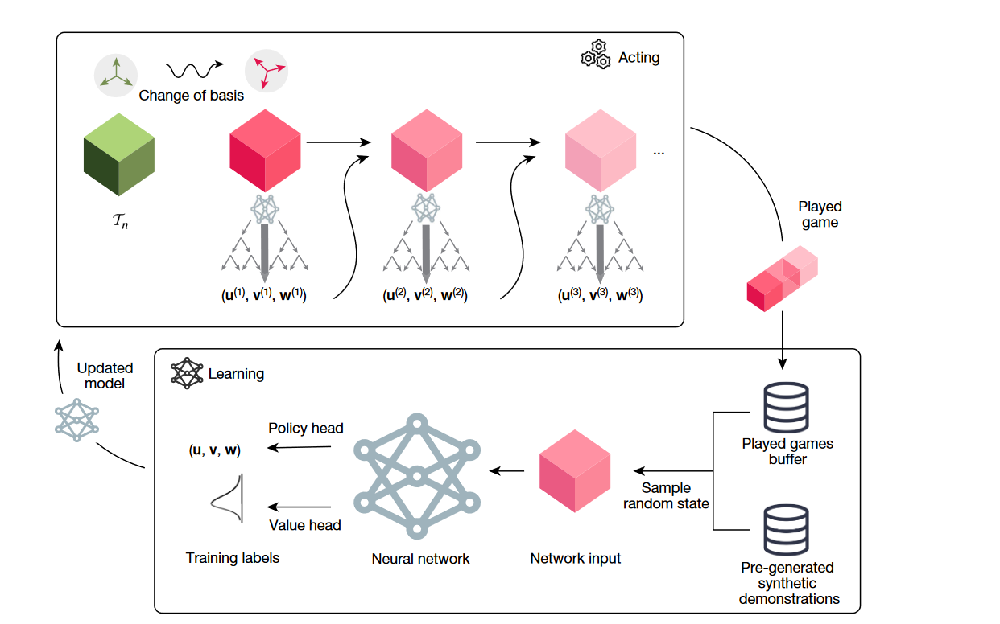

# AlphaTensor
The **AlphaTensor project**, inspired by AlphaZero, aims to decompose specific tensors into rank-1 tensors (CP rank). This decomposition result can be utilized in fast matrix multiplication algorithms 

## Implementing AlphaTensor relies mainly on two components
### Training: 
A neural network that takes input state information (A tensor decomposed by several rank-1 tensors and its time order) and outputs the corresponding policy related to next rank-1 tensor and value corrosponding to the tensor's rank.  
### Act:
Monte Carlo Tree Search (MCTS) guided by the neural network generating plenty of data about the specific tensor.

## The main steps to implement AlphaTensor (similar to AlphaZero)
### Data generation
Sampled from rank-1 tensors, generating extensive demonstration data, where each sample contains a tensor decomposed into several rank-1 tensors, with the number of rank-1 tensors representing the tensor's rank.
### Training NN
Training the neural network using both the demonstration data and MCTS data.
### MCTS generating data
Guided by the neural network, starting from a specific tensor that we aim to decompose, we utilize MCTS search to generate MCTS data related to that specific tensor.

## Helpful Resources
[AlphaZeroFromScratch](https://github.com/foersterrobert/AlphaZeroFromScratch) 

[nebuly](https://github.com/nebuly-ai/nebuly/)

[First Open Source Implementation of DeepMind’s AlphaTensor](https://www.kdnuggets.com/2023/03/first-open-source-implementation-deepmind-alphatensor.html)

## reference:
<a id="ref1">[1]</a> 
Fawzi and Alhussein. "Discovering faster matrix multiplication algorithms with reinforcement learning"

<a id="ref2">[2]</a> 
Silver and David. "Mastering Chess and Shogi by Self-Play with a General Reinforcement Learning Algorithm"

<a id="ref3">[3]</a> 
Hubert and Thomas. "Learning and Planning in Complex Action Spaces"

<a id="ref4">[4]</a> 
Silver and David. "Mastering the game of Go with deep neural networks and tree search"

