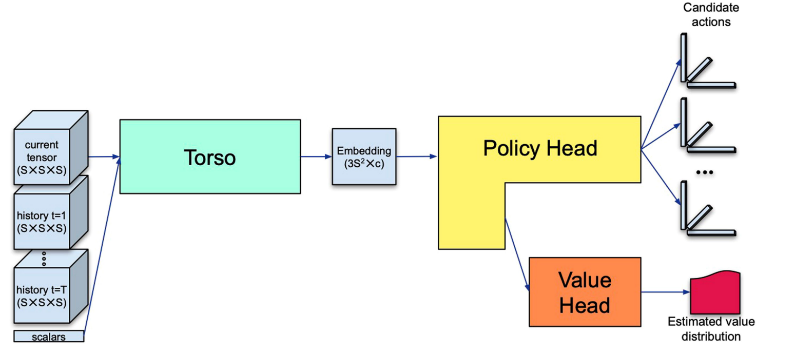
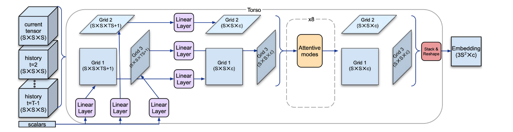
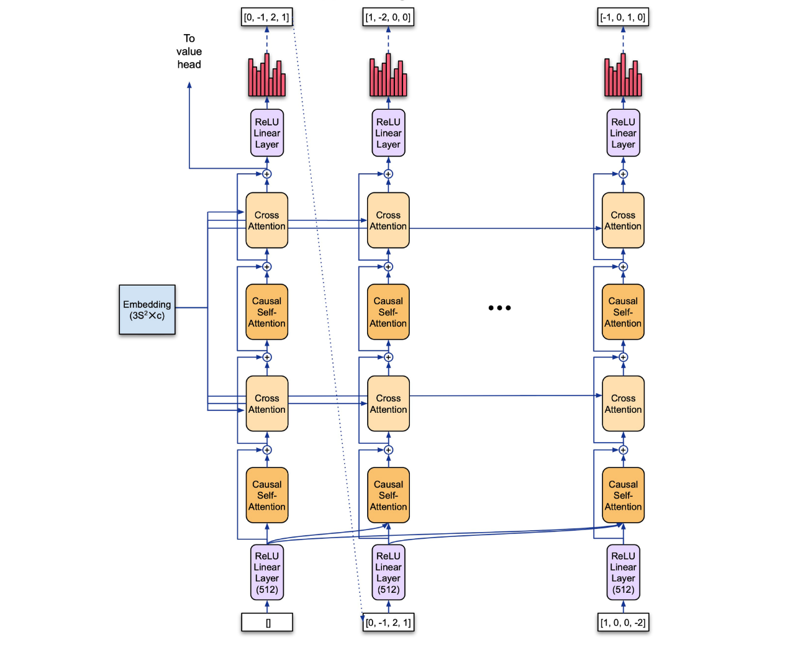
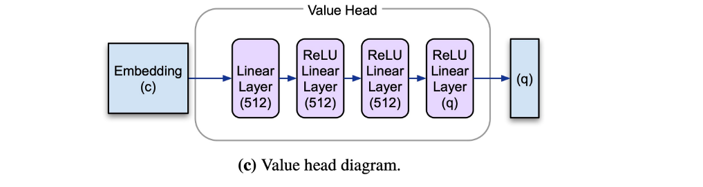

# Introduction for the neural network
## Network Architecture

## Torso

Input: several former states from current state on; scalars remarking the time order.  
Output: high dimension features  

### Main idea
1.By three dimension, stack states and scalars dealt by linear operation, and then give them linear transformation ending with three Grids. That is:
$$
L(States:T*S*S*S,scalars:s) \to 3*Grids:S*S*c
$$
a.The first step is to gather the information(states and scalars) together by three dimension;  
b.Outer linear operations don't change the information;  
c.The proposed architecture, which disregards the order of rows and columns in the grids, is inspired by the invariance of the tensor rank to slice reordering.

2.And then using some attention operations one another to generate three Grids.  
a.Using the axial attention improving model's ability to know about and deal with the data
b.attention operations don't change the data dimension.

3.At last stack them, namely a high dimension feature. 
## Policy head

Input: high dimension features generated by torso  
output: sampled actions, its probabilities, and features to value head
### Main idea
1.utilizing the features produced by torso; 
2.decompose the action which is a triple k tokens of dimension d such that k x d = 3S; 
3.autoregressive model

## Value head 

Input: features generated by policy head from the first token
Output: q outputs corresponding to the quantiles. 